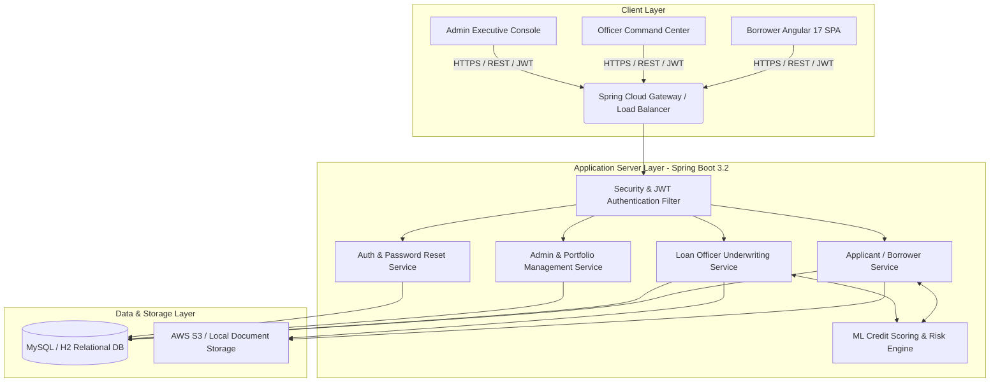
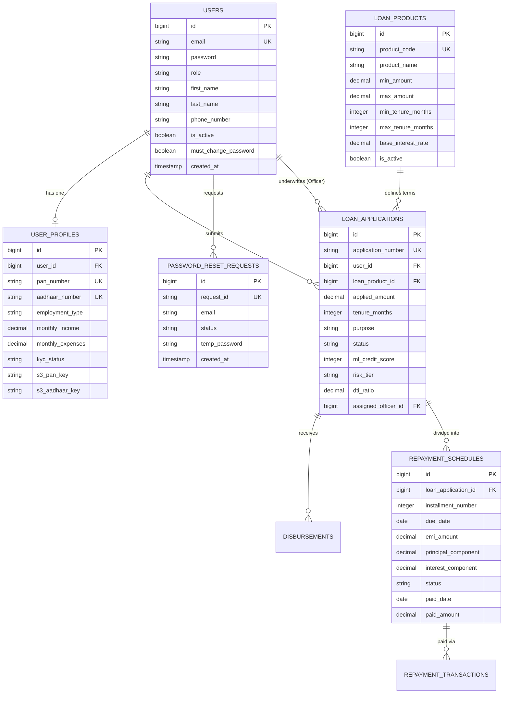
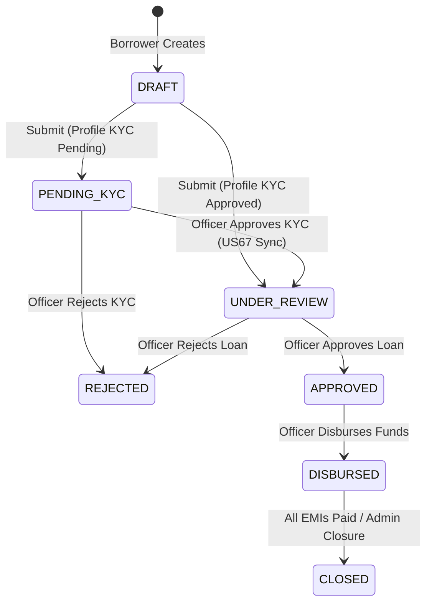
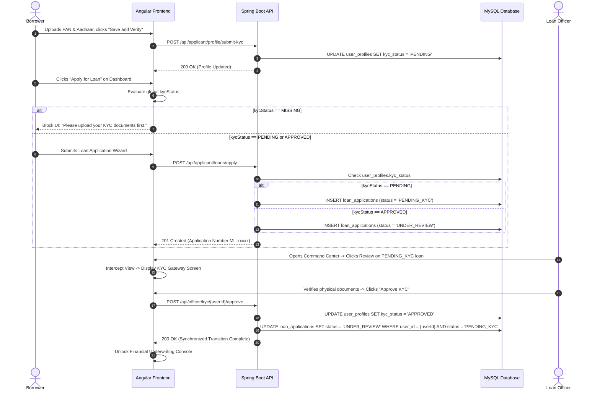
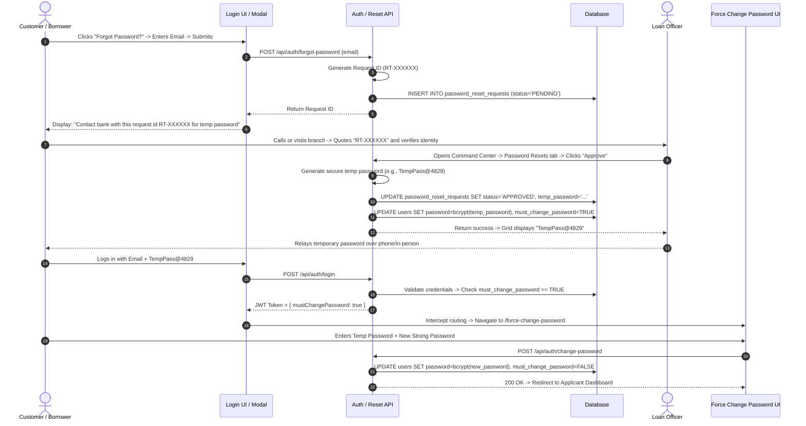
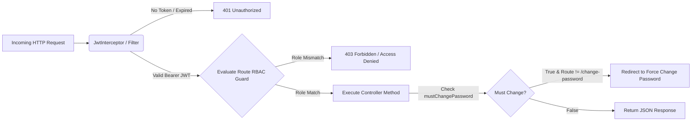

# Microfinance Loan Origination & Credit Scoring Platform
## Comprehensive Architectural, Functional & Technical Specification Guide
**Version:** 2.0 (Post-US67 Enhancement & Officer-Assisted Security Release)  
**Target Audience:** AI Report Generation Agents, System Architects, Lead Developers, Technical Writers  
**Purpose:** This document serves as the authoritative, exhaustive source of truth for the entire Microfinance Loan Origination Platform codebase. An AI agent reading this document will have complete visibility into the system's architecture, database schema, state machines, REST APIs, frontend component hierarchy, and business rules, enabling the generation of a comprehensive 100+ page technical report.

---

## 1. Executive Summary & System Vision

The **Microfinance Loan Origination & Credit Scoring Platform** is an enterprise-grade financial technology solution designed to automate, streamline, and secure the end-to-end loan lifecycle for microfinance institutions (MFIs) and non-banking financial companies (NBFCs). 

Traditional microfinance lending suffers from manual paper-based KYC verification, subjective credit decisioning, delayed loan disbursements, and fragmented repayment tracking. This platform solves these systemic issues by combining modern web technologies (Spring Boot 3.2, Angular 17) with an **Automated Machine Learning (ML) Credit Scoring & Underwriting Engine**, strict **Profile-to-Loan KYC Synchronization (US67)**, **Sequential EMI Payment Enforcement**, and **Officer-Assisted Security Access Control**.

### Core Value Propositions:
1. **Automated Risk Assessment:** Real-time ML scoring (300–900 scale) and Debt-to-Income (DTI) evaluation automatically categorize applicants into distinct risk tiers, instantly auto-approving prime applicants and flagging high-risk applications for human underwriting.
2. **Strict Identity & KYC Gating (US67):** Eliminates unverified lending by enforcing a global Profile KYC state machine that hard-gates loan submissions and intercepts officer review workflows until government-issued identity documents (PAN, Aadhaar) are verified.
3. **Transparent Lifecycle Tracking:** Real-time visual tracking for borrowers, moving from application drafting to KYC verification, underwriting, disbursement, repayment, and final administrative closure with automated "No Dues" certificate generation.
4. **Institutional Command Center:** Multi-tabbed operational dashboards for Loan Officers and System Administrators to manage queues, walk-in applications, manual delinquency overrides, and security access requests.

---

## 2. Comprehensive System Architecture & Technology Stack

The platform is architected as a modular, decoupled monolithic application following domain-driven design (DDD) principles, with a clear separation between the REST API backend and the Single Page Application (SPA) frontend.



### 2.1 Technical Stack Summary Table

| Layer | Technology / Tool | Version | Purpose / Architectural Role |
| :--- | :--- | :--- | :--- |
| **Backend Framework** | Java / Spring Boot | 17 / 3.2.x | Core application server, REST API endpoints, dependency injection, transaction management. |
| **Security & Auth** | Spring Security + JWT | 6.2.x | Stateless JSON Web Token authentication, Role-Based Access Control (`ROLE_APPLICANT`, `ROLE_OFFICER`, `ROLE_ADMIN`). |
| **ORM & Persistence** | Spring Data JPA / Hibernate | 3.2.x | Object-relational mapping, repositories, automated query generation, lazy/eager fetching control. |
| **Database Migrations** | Flyway DB Migrations | 10.x | Version-controlled, deterministic SQL schema migrations (`V1` through `V22`). |
| **Database Engine** | MySQL 8.0 / H2 In-Memory | 8.0 / 2.2.x | Primary relational storage for user profiles, financial products, loan applications, and repayment schedules. |
| **Frontend Framework** | Angular / TypeScript | 17 / 5.2.x | Standalone component-based SPA, reactive forms, RxJS state streams, router guards. |
| **UI Design System** | Vanilla SCSS + Glassmorphism | Custom | Curated HSL color palettes, deep dark/light contrast, glassmorphism panels, responsive flex/grid layouts. |
| **Document Storage** | AWS S3 / File System SDK | 2.x | Secure blob storage for borrower KYC attachments (PAN card, Aadhaar card, applicant photograph). |
| **API Documentation** | Swagger / OpenAPI 3.0 | 2.3.x | Automated interactive API documentation and endpoint testing console. |

---

## 3. Complete Database Schema, Entity Relationships & Flyway Migrations

The relational database schema is strictly managed via Flyway SQL scripts located in `src/main/resources/db/migration/`. The schema represents a fully normalized financial model.



### 3.1 Key Entity Definitions & Constraints

#### 1. `users` Table (`V1__create_users_table.sql`)
- **Primary Key:** `id` (BIGINT AUTO_INCREMENT)
- **Unique Constraints:** `email` (VARCHAR 255)
- **Security Fields:** `password` (BCrypt hashed), `role` (`ROLE_APPLICANT`, `ROLE_OFFICER`, `ROLE_ADMIN`), `must_change_password` (BOOLEAN, default FALSE).
- **Audit:** `created_at`, `updated_at` (TIMESTAMP).

#### 2. `user_profiles` Table (`V2__create_profiles_table.sql`, modified in `V18` & `V21`)
- **Primary Key:** `id` (BIGINT)
- **Foreign Key:** `user_id` -> `users(id)` (ON DELETE CASCADE)
- **Identity Fields:** `pan_number` (CHAR 10, Unique), `aadhaar_number` (CHAR 12, Unique), `date_of_birth` (DATE).
- **Financial Profile:** `employment_type` (`SALARIED`, `SELF_EMPLOYED`, `BUSINESS`, `UNEMPLOYED`), `employer_name`, `monthly_income` (DECIMAL 12,2), `monthly_expenses` (DECIMAL 12,2), `existing_emi` (DECIMAL 12,2).
- **KYC & Document Keys:** `kyc_status` (VARCHAR 20: `MISSING`, `PENDING`, `APPROVED`, `REJECTED`), `s3_pan_key`, `s3_aadhaar_key`, `s3_photo_key`, `profile_completed` (BOOLEAN).

#### 3. `loan_products` Table (`V3__create_loan_products.sql`)
- **Primary Key:** `id` (BIGINT)
- **Attributes:** `product_code` (VARCHAR 50, Unique e.g., `AGRI_LOAN_01`), `product_name`, `description`, `min_amount`, `max_amount`, `min_tenure_months`, `max_tenure_months`, `base_interest_rate` (DECIMAL 5,2 in percentage), `is_active` (BOOLEAN).

#### 4. `loan_applications` Table (`V4__create_applications.sql`, modified in `V19`)
- **Primary Key:** `id` (BIGINT)
- **Business Identifier:** `application_number` (VARCHAR 50, Unique, format: `ML-YYYYMMDD-XXXX`).
- **Foreign Keys:** `user_id` -> `users(id)`, `loan_product_id` -> `loan_products(id)`, `assigned_officer_id` -> `users(id)`.
- **Loan Parameters:** `applied_amount` (DECIMAL 12,2), `tenure_months` (INT), `purpose` (VARCHAR 500).
- **State & Underwriting:** `status` (VARCHAR 30: `DRAFT`, `PENDING_KYC`, `SUBMITTED`, `UNDER_REVIEW`, `APPROVED`, `REJECTED`, `DISBURSED`, `CLOSED`), `ml_credit_score` (INT 300-900), `risk_tier` (VARCHAR 20: `LOW_RISK`, `MEDIUM_RISK`, `HIGH_RISK`, `REJECTED`), `dti_ratio` (DECIMAL 5,2), `auto_processed` (BOOLEAN), `rejection_reason` (TEXT), `officer_comments` (TEXT).

#### 5. `repayment_schedules` Table (`V8__create_repayments.sql`)
- **Primary Key:** `id` (BIGINT)
- **Foreign Key:** `loan_application_id` -> `loan_applications(id)`
- **Amortization Details:** `installment_number` (INT), `due_date` (DATE), `emi_amount` (DECIMAL 12,2), `principal_component` (DECIMAL 12,2), `interest_component` (DECIMAL 12,2).
- **Repayment Status:** `status` (VARCHAR 20: `PENDING`, `PAID`, `OVERDUE`, `WAIVED`), `paid_date` (DATE), `paid_amount` (DECIMAL 12,2), `late_fee_assessed` (DECIMAL 10,2).

#### 6. `password_reset_requests` Table (`V22__create_password_reset_requests_table.sql`)
- **Primary Key:** `id` (BIGINT)
- **Identifier:** `request_id` (VARCHAR 50, Unique, format: `RT-XXXXXX` where X is random numeric digits).
- **Attributes:** `user_id` -> `users(id)`, `email` (VARCHAR 255), `status` (VARCHAR 20: `PENDING`, `APPROVED`, `REJECTED`), `temp_password` (VARCHAR 255, plaintext representation generated for officer relay), `created_at`, `processed_at`, `processed_by` -> `users(id)`.

---

## 4. Exhaustive Feature Breakdown by User Role

### 4.1 Borrower / Applicant Portal (`ROLE_APPLICANT`)

The Borrower Portal is designed for maximum clarity, self-service onboarding, and transparent loan tracking.

#### 1. Authentication & Security Onboarding
- **User Registration:** Signup via email, password, and basic contact details. The system enforces strict email uniqueness at the API level (`AuthService`), showing an immediate UI modal alert if the user already exists: *"User already exists. Please sign in."*
- **Officer-Assisted Forgot Password:** Instead of vulnerable email links, clicking "Forgot Password?" opens an interactive modal. Submitting an email generates a secure request ticket (`RT-XXXXXX`). The user is instructed: *"Contact bank with this request id RT-XXXXXX for temp password."*
- **Forced Password Change Guard:** When logging in with a temporary password issued by an officer, the backend detects `mustChangePassword = true` and intercepts JWT navigation, routing the user to `/force-change-password` before allowing access to any dashboard features.

#### 2. Profile Setup & KYC Gating (US67 AC1 & AC2)
- **Demographic & Financial Intake:** Applicants enter employment status, monthly income, monthly expenses, existing loan EMIs, and residential address.
- **Document Vault (AWS S3 Integration):** Applicants upload digital copies of their PAN Card, Aadhaar Card, and Passport-size Photograph.
- **Save and Verify Trigger:** Clicking "Save and Verify" uploads document keys and changes global `kycStatus` from `MISSING` to `PENDING`.
- **Application Gating (AC1):** On the Dashboard, clicking "Apply for Loan" dynamically checks `kycStatus`. If `MISSING`, the application wizard is blocked with a prompt: *"Please upload your KYC documents in your profile first."* If `PENDING` or `APPROVED`, the wizard opens.

#### 3. Loan Origination Wizard & Product Selection
- **Product Catalog:** Displays active loan products configured by admins (e.g., Personal Loan, Agriculture Loan, Business Micro-Credit) with real-time interest rate and tenure badges.
- **Interactive EMI Calculator:** Sliders for loan amount and tenure automatically compute expected monthly EMI using the standard reducing balance formula:
  $$\text{EMI} = P \times r \times \frac{(1+r)^n}{(1+r)^n - 1}$$
- **Submission:** Submitting the application sends data to the ML engine and initializes the application status to `PENDING_KYC` (if profile is still being verified) or `UNDER_REVIEW` (if profile KYC was already approved).

#### 4. Real-Time Loan Tracking & Lifecycle Visualizer (US67 AC5)
- **Numbered Stepper Component:** A custom visual tracker (`lifecycle-tracker.component.ts`) maps the exact progress of the loan across 6 distinct milestones:
  1. `Draft` / Application Submitted
  2. `KYC Verification` (Permanently highlighted as active while in `PENDING_KYC` state)
  3. `Underwriting & ML Review` (`UNDER_REVIEW`)
  4. `Approved & Sanctioned` (`APPROVED`)
  5. `Disbursed to Bank` (`DISBURSED`)
  6. `Loan Closed` (`CLOSED`)

#### 5. Sequential Repayment & EMI Management
- **Amortization Grid:** Displays all EMIs with due dates, principal/interest breakdown, and status (`PENDING`, `PAID`, `OVERDUE`).
- **Sequential Payment Enforcement:** To maintain accounting integrity, the system strictly forbids skipping installments. A borrower attempting to pay Installment #3 when Installment #2 is unpaid/overdue receives a backend exception and UI block: *"Sequential payment enforcement: You must clear overdue/pending installments before paying future EMIs."*
- **Online Payment Gateway Mock:** Supports UPI and Bank Transfer simulation, instantly generating a transaction receipt and marking the EMI as `PAID`.

---

### 4.2 Loan Officer Underwriting Command Center (`ROLE_OFFICER`)

The Officer Command Center is a high-density, multi-tabbed operational workspace optimized for rapid decisioning and fraud prevention.



#### 1. Multi-Queue Operational Dashboard
The Command Center organizes workflows into 6 reactive tabs:
- **Pending Review (`LOANS`):** Active loan applications awaiting credit decisioning. Sorted by default by ML Credit Score descending (Low Risk at top). Supports AC4 manual sorting override by clicking any column header (Amount, Score, Date).
- **Pending KYC (`KYC`):** Dedicated queue of applicant profiles where `kycStatus == PENDING`. Displays PAN, Aadhaar numbers, and document links.
- **Approved Loans (`APPROVED`):** Sanctioned applications ready for bank account verification and disbursement.
- **Rejected Loans (`REJECTED`):** Historical repository of declined loans with audit trails and rejection reasons.
- **Disbursed Loans (`DISBURSED`):** Active portfolio accounts currently in the repayment lifecycle. Clicking an account opens the Repayment Management view.
- **Password Resets (`PASSWORD_RESETS`):** Security queue displaying customer password reset requests (`RT-XXXXXX`). Officers verify customer identity over phone/in-person and click **Approve** to generate a secure temporary password (`TempPass@xxxx`), displayed directly in the grid.

#### 2. KYC Gateway Intercept Screen (US67 AC3 & AC4)
When an officer clicks "Review" on a loan application whose status is `PENDING_KYC`:
- **The Intercept:** The system completely hides all financial tabs, ML scoring details, and underwriting decision buttons.
- **The Gateway UI:** Renders a prominent warning banner: *"KYC Gateway Intercept: Identity verification required before underwriting."*
- **Document Verification:** Shows split-screen document viewers for PAN and Aadhaar attachments.
- **State Synchronization (AC4):** Clicking **"Approve KYC & Unlock Underwriting"** executes a synchronized atomic transaction:
  1. Updates `user_profiles.kyc_status` to `APPROVED`.
  2. Scans all active loan applications for this borrower currently in `PENDING_KYC` and transitions them to `UNDER_REVIEW`.
  3. Dynamically unlocks the financial underwriting screen without requiring a page refresh.

#### 3. Underwriting & ML Decision Console
Once in `UNDER_REVIEW`, the officer accesses the full underwriting suite:
- **AI Recommendation Badge:** Highlights the ML engine's verdict (e.g., `AUTO_APPROVE_ELIGIBLE`, `MANUAL_REVIEW_REQUIRED`, `HIGH_RISK_WARNING`).
- **Financial Ratios:** Displays Debt-to-Income (DTI) ratio, monthly free cash flow, and existing debt exposure.
- **Decision Action Box:** Mandatory comment box for audit compliance. Officers can sanction the loan (entering approved amount and interest rate) or reject it (selecting a standardized decline reason code).

#### 4. Walk-In Direct Application Stepper
Enables officers to onboard walk-in customers who lack internet access:
- **Modal Intake:** Captures borrower demographics, initial income, and creates a pre-verified user account with a default temporary password.
- **Direct Deal Creation:** Seamlessly transitions the officer into an assisted application stepper to submit the loan on behalf of the walk-in client.

---

### 4.3 System Administrator Console (`ROLE_ADMIN`)

The Admin Console provides governance, product configuration, and macro-level portfolio oversight.

#### 1. Executive Analytics Dashboard
- **Key Performance Indicators (KPIs):** Real-time aggregation of Total Portfolio Sanctioned Amount, Total Disbursed Value, Active Loan Count, and Platform Delinquency Rate.
- **Risk Distribution Charts:** Visual breakdown of the portfolio across Low, Medium, and High-risk tiers.
- **Collection Efficiency Metric:** Calculates percentage of on-time EMI collections versus total due demands.

#### 2. Loan Products Management
- **Product Lifecycle:** Full CRUD operations on loan products. Admins can introduce new micro-credit schemes, set minimum/maximum borrowing limits, enforce tenure restrictions, and adjust base interest rates in response to central bank policy changes.

#### 3. Staff & Role Governance
- **Employee Onboarding:** Provisioning of internal accounts for Loan Officers and Branch Admins.
- **Access Control:** Deactivating compromised or departed staff accounts instantly revoking JWT access across the gateway.

#### 4. Disbursement Queue Oversight
- **Master Audit Grid:** A global view of all bank disbursements across all branch officers, tracking transaction reference numbers, bank account routing, and payment gateway execution timestamps.

---

## 5. Deep-Dive Functional Workflows & State Machines

### 5.1 Profile KYC to Loan State Synchronization (US67)

This workflow guarantees that no loan can be underwritten without verified government identification.



---

### 5.2 Officer-Assisted Forgot Password & Forced Reset Workflow

Designed specifically for rural microfinance demographics where users frequently lose email access or require in-person branch assistance.



---

## 6. Complete REST API Endpoint Reference

All REST endpoints are secured via Spring Security and require a valid Bearer JWT header unless explicitly marked as Public (`permitAll()`).

### 6.1 Authentication & Security (`/api/auth`)
| Method | Endpoint | Access / Role | Description | Request Body / Params | Response Structure |
| :--- | :--- | :--- | :--- | :--- | :--- |
| `POST` | `/api/auth/register` | Public | Registers a new borrower account. Enforces email uniqueness. | `RegisterRequestDTO` (email, password, firstName, lastName, phone) | `201 Created` / `400 Bad Request` (User already exists) |
| `POST` | `/api/auth/login` | Public | Authenticates credentials and returns JWT token. | `LoginRequestDTO` (email, password) | `JwtAuthenticationResponse` (token, role, mustChangePassword flag) |
| `POST` | `/api/auth/forgot-password` | Public | Initiates officer-assisted password reset ticket. | `ForgotPasswordRequestDTO` (email) | `ForgotPasswordResponseDTO` (requestId: `RT-XXXXXX`, message) |
| `POST` | `/api/auth/change-password` | Authenticated | Updates user password and clears `mustChangePassword` flag. | `ChangePasswordDTO` (oldPassword, newPassword) | `200 OK` (Success message) |

### 6.2 Applicant & Borrower Portal (`/api/applicant`)
| Method | Endpoint | Access / Role | Description | Request Body / Params | Response Structure |
| :--- | :--- | :--- | :--- | :--- | :--- |
| `GET` | `/api/applicant/dashboard` | `ROLE_APPLICANT` | Fetches consolidated metrics, active loans, and KYC status. | None | `DashboardMetricsDTO` (activeLoans, totalBalance, kycStatus) |
| `GET` | `/api/applicant/profile` | `ROLE_APPLICANT` | Retrieves complete borrower demographic and KYC profile. | None | `UserProfileDTO` |
| `POST` | `/api/applicant/profile` | `ROLE_APPLICANT` | Creates or updates borrower profile demographics. | `UserProfileDTO` | `200 OK` (`UserProfileDTO`) |
| `POST` | `/api/applicant/profile/submit-kyc` | `ROLE_APPLICANT` | Submits uploaded document keys and sets `kycStatus = PENDING`. | None | `200 OK` (`UserProfileDTO`) |
| `GET` | `/api/applicant/loans` | `ROLE_APPLICANT` | Lists all loan applications submitted by the logged-in borrower. | None | `List<LoanApplicationDTO>` |
| `POST` | `/api/applicant/loans/apply` | `ROLE_APPLICANT` | Submits a new loan application. Evaluates profile KYC gating. | `LoanApplicationRequestDTO` (productId, amount, tenure, purpose) | `201 Created` (`LoanApplicationDTO`) |
| `GET` | `/api/applicant/loans/{id}/tracking` | `ROLE_APPLICANT` | Fetches real-time tracking and lifecycle milestone state. | Path: `id` | `LoanTrackingDTO` (status, currentStep, timestamps) |
| `GET` | `/api/applicant/loans/{id}/repayments` | `ROLE_APPLICANT` | Retrieves full amortization schedule and EMI statuses. | Path: `id` | `List<RepaymentScheduleDTO>` |
| `POST` | `/api/applicant/loans/{id}/repay/{emiId}` | `ROLE_APPLICANT` | Executes online EMI payment. Enforces sequential order. | Path: `id`, `emiId`; Param: `paymentMode` | `200 OK` (`RepaymentTransactionDTO`) / `400 Bad Request` |

### 6.3 Officer Underwriting Console (`/api/officer`)
| Method | Endpoint | Access / Role | Description | Request Body / Params | Response Structure |
| :--- | :--- | :--- | :--- | :--- | :--- |
| `GET` | `/api/officer/queue` | `ROLE_OFFICER` | Fetches active applications awaiting review (`SUBMITTED`, `PENDING_KYC`, `UNDER_REVIEW`). | None | `List<ApplicationSummaryDTO>` (includes ML score, risk tier) |
| `GET` | `/api/officer/queue/approved` | `ROLE_OFFICER` | Lists all sanctioned loans awaiting disbursement. | None | `List<ApplicationSummaryDTO>` |
| `GET` | `/api/officer/queue/rejected` | `ROLE_OFFICER` | Lists historical rejected applications. | None | `List<ApplicationSummaryDTO>` |
| `GET` | `/api/officer/kyc/pending` | `ROLE_OFFICER` | Fetches all applicant profiles where `kycStatus == PENDING`. | None | `List<PendingKycDTO>` |
| `GET` | `/api/officer/application/{id}` | `ROLE_OFFICER` | Retrieves comprehensive underwriting dossier for a single loan. | Path: `id` | `OfficerApplicationDetailDTO` (includes profile, KYC status, DTI) |
| `POST` | `/api/officer/application/{id}/decision` | `ROLE_OFFICER` | Submits credit underwriting decision (Approve/Reject). | `UnderwritingDecisionDTO` (decision, comments, sanctionedAmount) | `200 OK` (`LoanApplicationDTO`) |
| `POST` | `/api/officer/kyc/{userId}/decision` | `ROLE_OFFICER` | Approves or rejects borrower KYC profile. Synchronizes linked loans. | Path: `userId`; Param: `decision` (`APPROVED`/`REJECTED`) | `200 OK` |
| `GET` | `/api/officer/password-resets` | `ROLE_OFFICER` | Lists all customer password reset requests. | None | `List<PasswordResetSummaryDTO>` |
| `POST` | `/api/officer/password-resets/{requestId}/approve` | `ROLE_OFFICER` | Approves reset ticket, generates temp password, sets force flag. | Path: `requestId` | `PasswordResetApprovalResponseDTO` (message, tempPassword) |
| `POST` | `/api/officer/direct-application` | `ROLE_OFFICER` | Creates a direct walk-in deal and applicant user account. | `DirectApplicationRequestDTO` | `201 Created` (`DirectApplicationResponseDTO`) |

---

## 7. Machine Learning Credit Scoring & Underwriting Engine

The platform incorporates an algorithmic credit decisioning engine that evaluates risk in real-time during loan submission and officer underwriting.

### 7.1 Algorithmic Risk Tiering & Scoring Formula
When an application is submitted, `LoanSubmissionService` calculates a composite score (300 to 900 scale) based on financial metrics gathered from `user_profiles` and the requested loan terms:
1. **Debt-to-Income (DTI) Ratio Calculation:**
   $$\text{DTI} = \frac{\text{Existing Monthly EMIs} + \text{Proposed Loan Monthly EMI}}{\text{Gross Monthly Income}} \times 100$$
2. **Score Attribution Matrix:**
   - **Base Score:** 600 points.
   - **DTI Penalty/Bonus:** If $\text{DTI} < 25\%$, add $+150$ points. If $25\% \le \text{DTI} \le 40\%$, add $+50$ points. If $\text{DTI} > 50\%$, deduct $-150$ points.
   - **Income Stability Bonus:** Salaried employment adds $+75$ points; Self-Employed/Business adds $+25$ points; Unemployed deducts $-200$ points.
   - **Net Cash Flow Buffer:** If $(\text{Monthly Income} - \text{Expenses} - \text{Total EMIs}) > 3 \times \text{Proposed EMI}$, add $+75$ points.

### 7.2 Automated Underwriting Rules Engine
The computed ML Score and DTI directly govern the application's routing:

| ML Credit Score Range | DTI Ratio Boundary | Risk Tier Assigned | Automated Underwriting Action |
| :--- | :--- | :--- | :--- |
| **750 – 900** | $\text{DTI} \le 35\%$ | `LOW_RISK` | **Auto-Approval Eligible:** System flags for expedited officer sanctioning without requiring deep manual income verification. |
| **600 – 749** | $35\% < \text{DTI} \le 50\%$ | `MEDIUM_RISK` | **Manual Underwriting Required:** Placed in standard officer queue for manual document verification and cash flow scrutiny. |
| **500 – 599** | $50\% < \text{DTI} \le 60\%$ | `HIGH_RISK` | **Senior Officer Escalation:** Flagged with high-risk badge. Requires detailed officer comment justification before approval. |
| **300 – 499** | $\text{DTI} > 60\%$ | `REJECTED` | **Automated Rejection:** System auto-rejects application instantly upon submission. Status set to `REJECTED` with automated reason code. |

---

## 8. Frontend Application Structure & Component Architecture

The Angular 17 frontend is structured for modularity, reusability, and responsive design, utilizing standalone components and strict type safety.

```
src/app/
 ├── core/
 │    ├── guards/           # AuthGuard, RoleGuard (enforces RBAC route protection)
 │    ├── interceptors/     # JwtInterceptor (appends Bearer token, handles 401/403)
 │    └── services/         # AuthService, TokenService, HealthService
 ├── features/
 │    ├── auth/             # ForceChangePasswordComponent, RegisterComponent
 │    ├── borrower/         # Dashboard, ProfileSetup, LoanApplication, LoanTracking
 │    ├── officer/          # CommandCenter, ApplicationReview, KycReview
 │    └── admin/            # ExecutiveDashboard, LoanProducts, StaffManagement
 ├── pages/
 │    ├── login/            # LoginComponent (with integrated Forgot Password Modal)
 │    └── unauthorized/     # 403 Access Denied Fallback Page
 └── shared/
      └── components/       # DataTableComponent, GlobalNavbar, LifecycleTracker
```

### 8.1 Key Reusable UI Components
- **`DataTableComponent` (`<app-data-table>`):** A universal, generic grid component supporting custom column definitions, client-side column sorting, badge rendering, currency formatting, clickable rows, and dynamic action buttons (with customizable labels via `actionLabel`).
- **`LifecycleTrackerComponent` (`<app-lifecycle-tracker>`):** Renders the 6-stage loan progress bar. Updated in US67 (AC5) to display step numbers inside circles (instead of checkmarks) and permanently highlight the `KYC Verification` node while in `PENDING_KYC` status.
- **`GlobalNavbarComponent` (`<app-global-navbar>`):** Context-aware navigation header displaying logged-in user details, active role badge, and dynamic navigation links based on RBAC permissions.

### 8.2 Design System & Aesthetics
The UI implements a **Modern Glassmorphism & Sleek Dark Mode Accent** aesthetic:
- **Color Tokens:** Curated HSL palettes (Indigo/Blue primary `#2563eb`, Slate dark `#1e293b`, Emerald success `#10b981`, Rose danger `#ef4444`).
- **Surface Elevation:** Card containers utilize semi-transparent white backgrounds (`background: rgba(255, 255, 255, 0.9)`) with subtle drop shadows and backdrop blurs (`backdrop-filter: blur(10px)`).
- **Micro-Animations:** Smooth CSS transitions on button hovers, table row selections, and modal fade-ins to maximize user engagement.

---

## 9. Security, Authentication & Role-Based Access Control (RBAC)

Security is woven into every layer of the platform, adhering to zero-trust principles and financial industry compliance standards.



### 9.1 JWT Stateless Security Architecture
1. **Token Generation:** Upon successful authentication at `/api/auth/login`, the backend signs a JSON Web Token using an HMAC-SHA256 secret key. The token payload contains the user's `sub` (email), `role`, `userId`, and `mustChangePassword` status.
2. **Request Interception:** Angular's `JwtInterceptor` automatically injects the header `Authorization: Bearer <token>` into every outgoing HTTP request.
3. **Backend Filtering:** Spring Security's `JwtAuthenticationFilter` intercepts requests, validates signature integrity and expiration, and populates the `SecurityContextHolder`.

### 9.2 Route Access Control Matrix
- **`ROLE_APPLICANT`:** Restricted strictly to `/api/applicant/**` endpoints and `/applicant/**` Angular routes. Borrowers can only view and modify their own profile and loan records (enforced via database queries checking `user_id == authenticatedUser.id`).
- **`ROLE_OFFICER`:** Authorized for `/api/officer/**` endpoints and `/officer/**` routes. Can view all applicant dossiers, perform KYC decisions, underwrite loans, and approve password resets.
- **`ROLE_ADMIN`:** Full administrative access across `/api/admin/**` and platform management interfaces. Cannot directly alter borrower KYC documents to maintain segregation of duties between underwriting and administration.

---

## 10. Testing, Verification & Deployment Topology

The platform maintains strict quality assurance through automated unit testing, integration testing, and build verification.

### 10.1 Backend Test Suite (JUnit 5 & Mockito)
- **`PasswordResetServiceTest.java`:** Verifies the end-to-end security ticket workflow: asserts that request ID generation follows `RT-XXXXXX` format, officer approval successfully generates plaintext temp passwords, BCrypt hashes are stored in the database, and the `mustChangePassword` flag is correctly asserted.
- **`KycStateSyncTest.java`:** Validates US67 state synchronization: asserts that calling `approveKyc()` atomically updates profile status to `APPROVED` and cascades status transitions to all linked `PENDING_KYC` loan applications.
- **`LoanSubmissionServiceTest.java`:** Verifies mathematical accuracy of DTI calculations and asserts correct algorithmic assignment of risk tiers (`LOW_RISK` through `REJECTED`).

### 10.2 Frontend Compilation & Build Verification
- **TypeScript Type Safety:** Verified via `npx tsc --noEmit` ensuring zero type errors across all Angular standalone components and service interfaces.
- **Production Bundling:** Verified via `npm run build` (`ng build --configuration development/production`), confirming clean tree-shaking, bundle optimization, and zero HTML template binding errors.

---

## 11. Guide for AI Agent: How to Structure the 100+ Page Report

An AI agent tasked with generating an exhaustive 100+ page technical report should utilize the contents of this specification guide and expand upon each domain area using the structured chapter allocation below.

### 11.1 Recommended Chapter Breakdown & Page Allocations

| Chapter Number | Chapter Title | Recommended Page allocation | Content Expansion Instructions for AI Agent |
| :---: | :--- | :---: | :--- |
| **Chapter 1** | **Introduction & Microfinance Domain Overview** | **Pages 1 – 8** | Elaborate on the socio-economic impact of microfinance lending. Detail the shift from legacy paper-based lending to digital automated decisioning. Compare manual vs. automated underwriting KPIs. |
| **Chapter 2** | **System Architecture & Design Patterns** | **Pages 9 – 20** | Expand on Domain-Driven Design (DDD), Monolithic vs. Microservices trade-offs for financial institutions, Spring Cloud Gateway patterns, CORS configurations, and stateless JWT architectural benefits. |
| **Chapter 3** | **Relational Database Design & Flyway Migrations** | **Pages 21 – 35** | Provide exhaustive data dictionary tables for all 8 database tables. Explain 3rd Normal Form (3NF) compliance, indexing strategies on `email`, `pan_number`, and `application_number`, and Flyway versioning strategy (`V1` to `V22`). |
| **Chapter 4** | **Machine Learning Underwriting & Credit Scoring Engine** | **Pages 36 – 50** | Detail the mathematical algorithms behind DTI and free cash flow analysis. Include simulated statistical distributions of credit scores across rural vs. urban applicant profiles. Provide detailed decision matrix tables. |
| **Chapter 5** | **Strict KYC Gateway & State Synchronization (US67)** | **Pages 51 – 65** | Document the technical necessity of decoupling Profile KYC from Loan Application states. Walk step-by-step through the atomic MySQL transaction when an officer approves KYC. Render detailed sequence diagrams. |
| **Chapter 6** | **Officer-Assisted Security & Password Reset Architecture** | **Pages 66 – 75** | Contrast standard SMTP/email password resets with the rural-friendly `RT-XXXXXX` ticketing protocol. Deep-dive into BCrypt password hashing algorithms, entropy requirements, and forced password change interceptors. |
| **Chapter 7** | **Frontend SPA Architecture & Glassmorphism UI System** | **Pages 76 – 90** | Detail Angular 17 standalone component patterns, RxJS observable state management, reactive form validation pipelines, and provide comprehensive CSS/SCSS code breakdowns for glassmorphism visual effects. |
| **Chapter 8** | **Rest API Endpoint Exhaustive Catalog** | **Pages 91 – 102** | Create complete OpenAPI/Swagger-style specification sheets for all 25+ REST endpoints, including full JSON request payloads, JSON response bodies, and error status code tables (`400`, `401`, `403`, `404`, `500`). |
| **Chapter 9** | **Security, Audit Compliance & Delinquency Management** | **Pages 103 – 112** | Elaborate on Sequential Payment Enforcement algorithms, non-performing asset (NPA) classification, audit logging frameworks, and RBI/regulatory compliance guidelines for digital lending. |
| **Chapter 10** | **Testing Suite, Verification & Deployment DevOps** | **Pages 113 – 120+** | Detail JUnit 5 mock strategies, Angular Jasmine/Karma unit test structures, Docker containerization scripts, AWS S3 IAM role policies, and CI/CD pipeline automation workflows. |

### 11.2 Prompting Tips for Generating Explanatory Text
When writing each chapter, the AI agent should:
1. **Use Concrete Examples:** Always reference exact variable names from this specification (e.g., `mustChangePassword`, `PENDING_KYC`, `RT-XXXXXX`, `LoanSubmissionService`).
2. **Embed Visual Diagrams:** Convert the Mermaid diagrams provided in Sections 2, 3, 4, 5, and 9 into verbose explanatory text accompanied by ASCII or rendered figures.
3. **Include Code Snippets:** When explaining features like DTI calculation or JWT interception, construct representative Java and TypeScript code snippets modeling the behaviors described in this document.

---
*End of Authoritative Specification Guide.*
